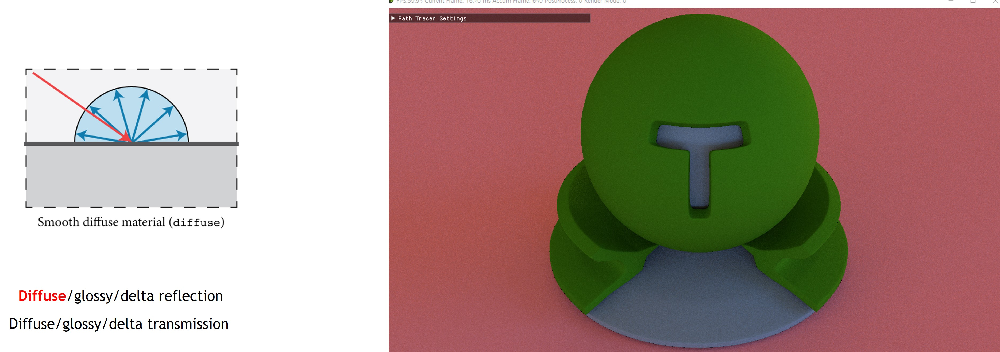
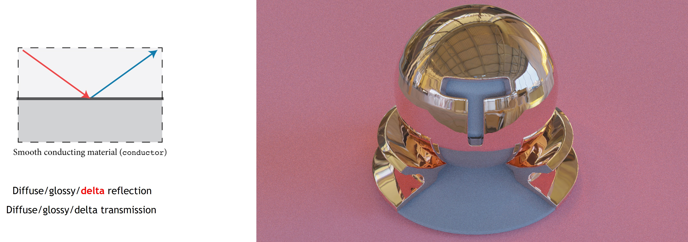
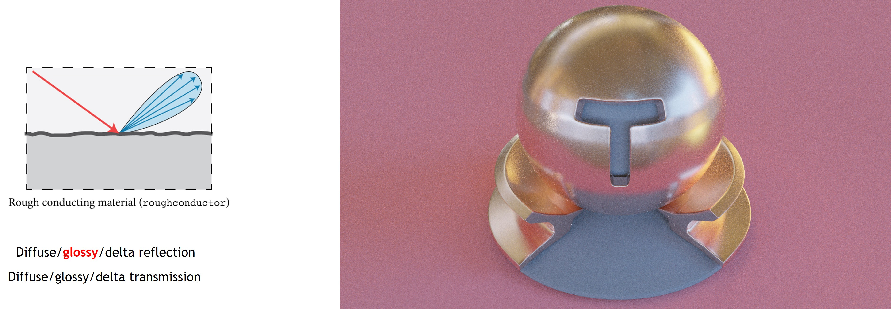
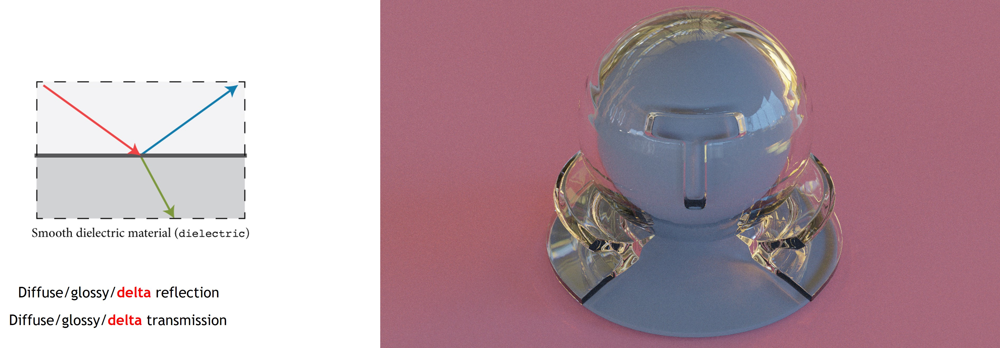
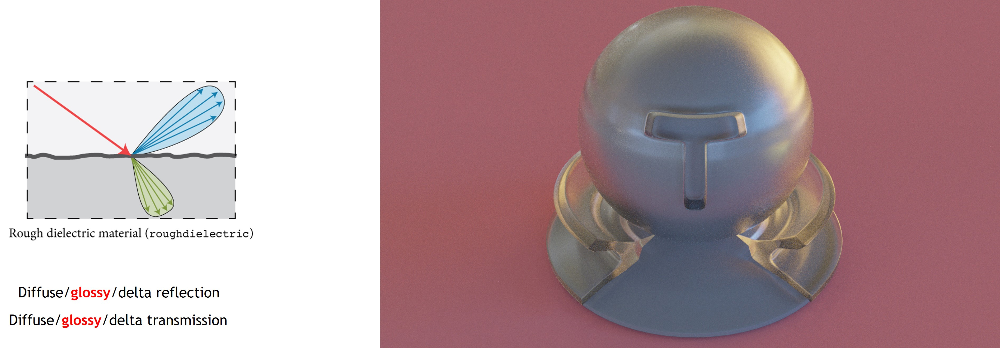
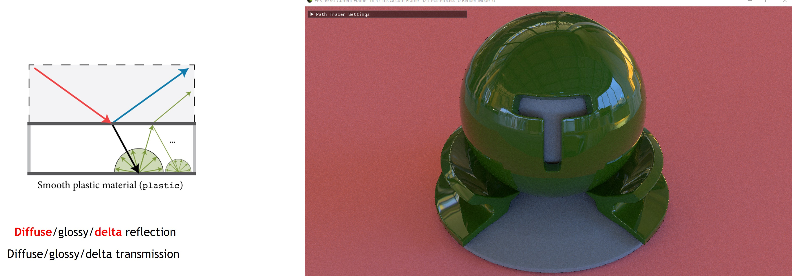
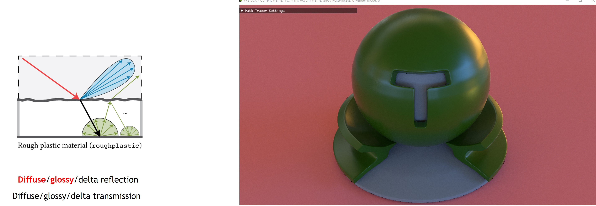

# Material Info

This document explains the materials (BSDF) used in the renderer.
Basically, I used mitsuba-styled BSDF, and also referred to [tungsten renderer](https://github.com/tunabrain/tungsten).

### Diffuse

### Conductor

### Rough Conductor

### Dielectric

### Rough Dielectric

### Plastic

### Rough Plastic

