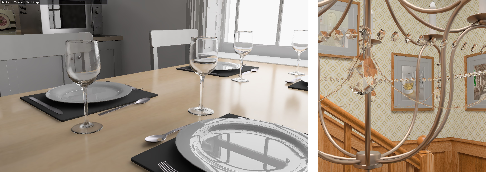

# DXRPathTracer

This is a real-time 1spp path tracer based on DirectX RayTracing.
Detailed daily work process could be found [here](WorkProgress.md).

## Project Overview
The goal of this project is to implement a scalable path tracer that runs in real-time.
Implementing path tracer largely refered from [Mitsuba renderer](https://github.com/mitsuba-renderer/mitsuba)
and my previous custom [path tracer](https://github.com/juhyeonkim95/MitsubaPyOptiX).
In order to achieve real-timeness, I try two approahces.
First is to exploit denoising techniques.
Second is to employ better sampling strategies.
Among the various methods, I choose to implement SVGF and ReSTIR respectively.

## Project Timeline
- Week 1~3 : Implement basic path tracer using DirectX12.
- Week 4,5 : Denoising based on SVGF.
- Week 6 : Enhance sampling quality using ReSTIR.
- Week 7,8 : Denoising revisited. Implement advanced algorithm RELAX.

## Requirements
This project is implemented based on the framework of [DxrTutorials](https://github.com/NVIDIAGameWorks/DxrTutorials).

It was developed using Visual Studio 2019 16.11. 

Windows 10 SDK 19041 or later is required.

You also need to install [DirectXTex](https://github.com/microsoft/DirectXTex).

## Scene Data
For scene data format, [Mitsuba renderer](https://github.com/mitsuba-renderer/mitsuba)'s format was used.
Refer mitsuba renderer for the details.
Example scenes could be downloaded from [here](https://benedikt-bitterli.me/resources/).

## Example Scene 

## Implementation Progress
### (Week 1~3) Core Path Tracer
#### Shape
- [x] Mesh
- [x] Rectangle
- [x] Cube
- [ ] Sphere
- [ ] Disk
- [ ] Cylinder
#### BSDF
- [x] Diffuse
- [x] Conductor
- [x] Rough Conductor
- [x] Dielectric
- [x] Rough Dielectric
- [x] Plastic
- [ ] Rough Plastic
- [ ] Disney
#### Emitter
- [x] Area (rectangle only)
- [x] Environment
- [ ] Point
- [ ] Directional
- [ ] Spotlight
#### Integrator (Rendering Equation Estimator)
- [x] Path Tracer
- [x] Path Tracer with MIS (direct light sampling)
- [ ] Path Tracer with MIS / multiple lights
- [ ] Guided Path Tracer

### (Week 4, 5) Denoising (SVGF)
- [x] Basic SVGF
- [x] Variance filtering

### (Week 6, 7) Enhancing Sampling Quality (ReSTIR)
- [x] Basic Resampling
- [x] Temporal Reuse
- [ ] Spatial Reuse

### (Week 7, 8) Advanced denoising
- [x] Delta reflection motion vector
- [x] Delta transmission motion vector
- [x] RELAX diffuse version
- [x] RELAX specular version

## Usage
(WIP)

## Acknowledgement
This project was supported by [PearlAbyss](https://www.pearlabyss.com/ko-kr).