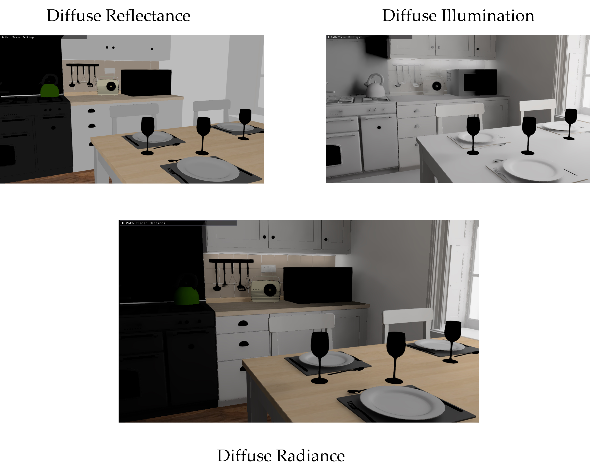

# Render Pipeline

This document explains the render pass of the path tracer.
Basically, the structure inspired by the NVIDIA Falcor's PathTracerNRD.

The overall structure looks like the below.


## Render Pass Decomposition
Radiance is decomposed into several components and each component is denoised respectively.

<!---
<span style="color:blue">diffuseReflectance</span> x <span style="color:red">diffuseIllumination</span> + 

<span style="color:blue">specularReflectance</span> x <span style="color:red">specularIllumination</span> + 

<span style="color:blue">emission</span> + 

<span style="color:blue">deltaReflectionReflectance</span> x <span style="color:red">deltaReflectionIllumination</span> + 

<span style="color:blue">deltaTransmissionReflectance</span> x <span style="color:red">deltaTransmissionIllumination</span> + 

<span style="color:blue">deltaReflectionEmission</span> +

<span style="color:blue">deltaTransmissionEmission</span> +

<span style="color:red">residualRadiance</span>-->

<!-- Note that blue colored components are noise-free input and red colored components are noisy input which need to be denoised.-->


Each component will be explained in the following section.


### Diffuse Pass
A path whose first reflection is diffuse reflection belongs to here.
(BSDF example : diffuse, roughplastic) 



### Specular Pass
A path whose first reflection is specular reflection belongs to here.
(BSDF example : roughplastic, roughconductor) 


### Delta Reflection Pass
A path whose first reflection is delta-reflection belongs to here.
(BSDF example : plastic, conductor, dielectric) 


### Delta Transmission Pass
A path whose first reflection is delta-transmission and experiences delta-transmission only
 (total internal reflection is an exception) belongs to here.
(BSDF example : dielectric) 


### Residual Pass
A path whose first reflection is delta-transmission and experiences both delta-reflection and delta-transmission belongs to here.
(BSDF example : dielectric) 


## RELAX
The overall RELAX implementation refers from the original code.
My RELAX implementation composes of three components.

- Temporal accumulation
- Disocclusion fix
- A-Trous wavelet filtering

At temporal accumulation step, we check consistency from motion vector and accumulate value if it is determined to be consistent.
At disocclusion fix step, we fix just disoccluded (history length is smaller than 4) pixels.
At A-Trous wavelet filtering step, we apply spatial filtering to produce more stable image.

The motion vector is used for fetching corresponding previous pixel.
It could be easily calculated as below.

```cpp
// Reprojection
float4 projCoord = mul(float4(position, 1.0f), g_frameData.previousProjView);
projCoord /= projCoord.w;
float2 prevPixel = float2(projCoord.x, -projCoord.y);
prevPixel = (prevPixel + 1) * 0.5;
```

The motion vector used for delta-reflection / transmission is different.

## Motion Vector Calculation

### Delta Reflection
In the case of delta-reflecion, motion vector can be calculated analytically.


### Delta Transmission
In the case of delta-reflecion, motion vector cannot be calculated analytically.
We thus exploit the heuristics like below.


