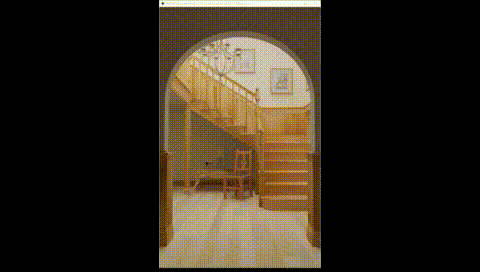

This document describes daily work progess of the project.

## 20220630, 20220701
Understand basics of DXR (reference : https://intro-to-dxr.cwyman.org/)
- Raytracing pipeline (anyhit-closesthit-miss)
- DXR Initialization & setup
- Acceleration structure (BLAS, TLAS)
- Root signature & association
- Ray tracing pipeline state object (RTPSO)
- Shader table

## 20220704
- Implemented a very simple ray tracer that loads meshes and show geometry only.

## 20220705
- Implement very simple ConstantBuffer that includes mesh color
- Need to change StructuredBuffer?

## 20220706
- Still studying StructuredBuffer
- In order to access normal, uv information, implementing StructuredBuffer is inevitable!
- Changed mesh color buffer from ConstantBuffer to StructuredBuffer.
- How to implement normal/uv information buffer? (StructuredBuffer vs ByteAddressBuffer)

## 20220707
- Load UV/Normal infomation using StructuredBuffer
- Try to apply texture. Creating buffer is done, but uploading texture data is troublesome.
- Exploit external library (DirectXTex)

## 20220708
- Load a single texture using DirectXTex.
- Implement per-instance texture loading using per-instance SRV.
- Working on loading XML file better way. 

## 20220711
- Implement new geometry (rectangle, cube) by transforming it into a mesh. (no additional intersection program)
- Implement a simple rectangular emitter.
- Diffuse only real-time path tracer.

## 20220712
- Implement MIS(Multiple Importance Sampling) with single light
- Code refactoring

## 20220713
- Reduce recursion depth by moving shadowray program from closest hit to raygen program.

Performance Comparison for kitchen scene (256 spp, ms)

| Frame   | depth 2 | depth 1 |
|---------|---------|---------|
| 1       | 1389    | 953     |
| 2       | 1375    | 959     |
| 3       | 1354    | 978     |
| 4       | 1350    | 940     |
| 5       | 1351    | 944     |
| 6       | 1366    | 941     |
| Average | 1364    | 953     |

About x1.5 speed up!

- Working on organizing BSDF sampling / pdf / eval and light sampling code.

## 20220714
- Implement an environment light.
- Implement Conductor
- Implement Dielectric

## 20220715
- Implement Rough Conductor
- Implement Rough Dielectric
- Implement Plastic

## 20220718
- Try to apply filtering & denoising.
- Reading SVGF, A-SVGF paper.

## 20220719
- Try to implement SVGF
- MIS with multiple light (uniformly select one light)

## 20220720
- Read ReSTIR paper.

## 20220721
- Code refactoring.
- Still reading SVGF.

## 20220722
- Implement postprocessing.

## 20220725
- Implement postprocessing with multiple shaders.
- Implementing SVGF using post processing (previously implemented on ray-tracing program).

## 20220726
- SVGF v1.0 implemented.
- Visible artifacts exist --> need to correct it.

## 20220727
- Trying to resolve artifacts
- Material specific problem --> do not demodulate non-diffuse materials.
- Temporal unstability --> improved by adopting historyLength instead of fixed value (0.2)

## 20220728
- Post processing code refactoring
- SVGF artifact resolving.
- If pixel has been just disoccluded, it's tend to be so noisy as the figure below.

- Before applying variance filter

- After applying variance filter

## 20220729
- Code refactoring.
- GUI using ImGui.

## 20220801
- Reading ReSTIR paper.
- Try to implement basic ReSTIR.

## 20220802
- Implemented ReSTIR only using temporal reuse.

## 20220803
- Integrated ReSTIR into path tracing pipeline.
- Restructuring program to implement ReSTIR with spatial reuse.

## 20220804
- Still restructuring project.
- Making several render pass that inspired from Falcor's.

## 20220805
- Created following render passes.
  - Path Tracer Pass
  - SVGF Pass
  - Blend Pass
  - Tonamap Pass
  - FXAA Pass

- Overall descriptor / resource heap structure

## 20220808
- Reading [RELAX](https://www.nvidia.com/en-us/on-demand/session/gtcspring21-s32759/), the follow up work for SVGF.
- Code refacoring (path tracer shader parts).

## 20220809
- Still struggling with SVGF artifacts. (a-trous filtering seems has a problem)

## 20220810
- Succeed to resolve A-trous filtering problem.
- Should make a different constant buffers so that uploading value to one buffer does not interrupt the others ([reference](https://www.braynzarsoft.net/viewtutorial/q16390-directx-12-constant-buffers-root-descriptor-tables)).

## 20220811
- Complete unfinished part in materials (plastic, roughplastic).
- Implementing RELAX + NVIDIA NRD pass.
- Divided radiance into diffuse, specular, delta reflection, delta transmission components (What's next?).

## 20220812
- Still implementing RELAX

## 20220813, 14, 15
- Implement delta reflection / refraction motion vector calculation
- RELAX diffuse / specular version implement
